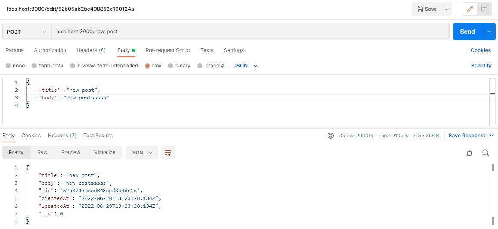
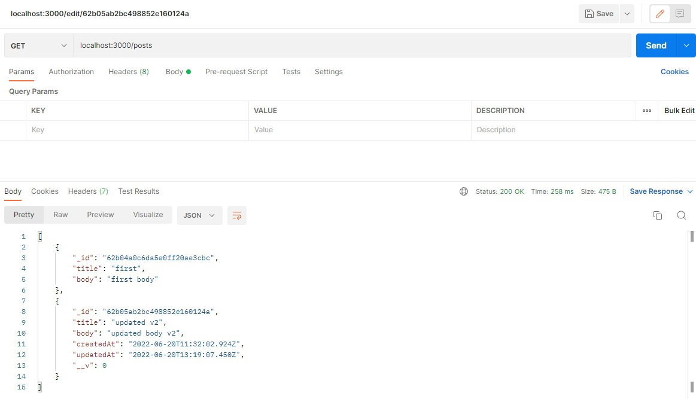
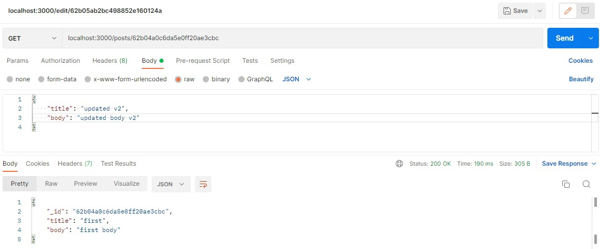
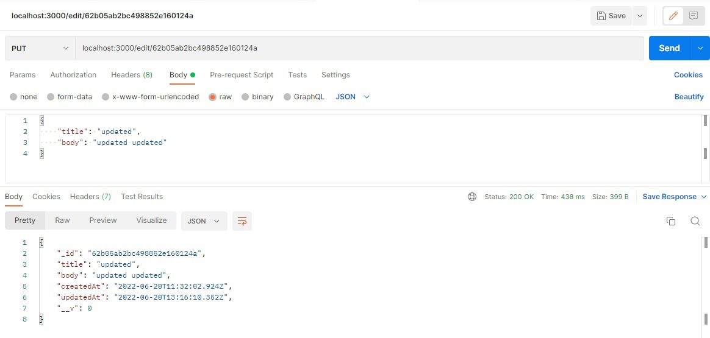

# CRUD opertions in MVC
> ## used:
> * express.js
> * mongoose
> * Postman

---

### Create operation

### Get posts

### Get post by id

### Edit

### Delete
> ###### I cant show how deletion function working, but trust me it works

